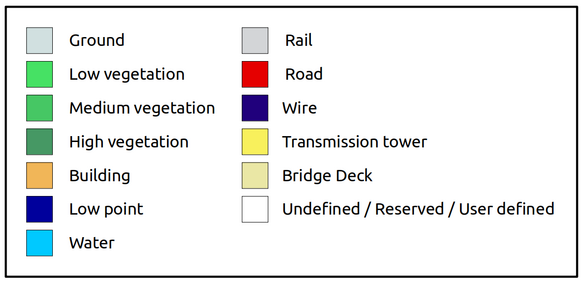
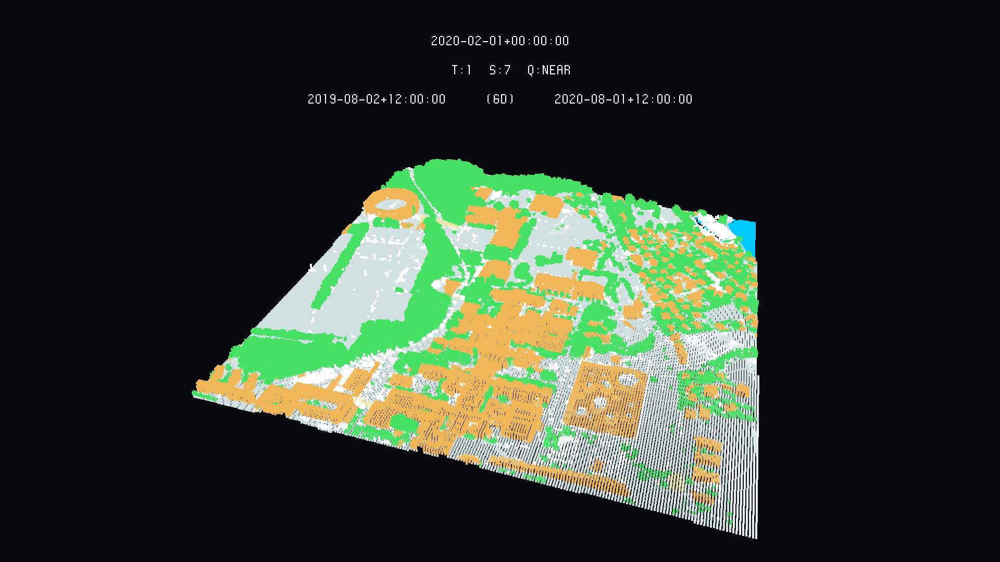
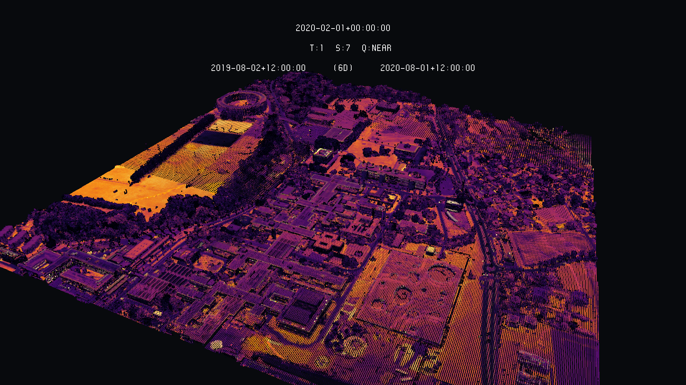
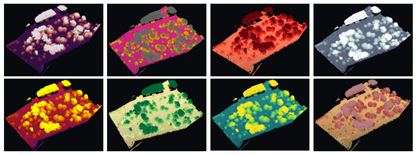

# Overview

This is writing uv3 files out of LiDAR data (.las), so they can be injected into the eratosthene platform. There are many options available on how to manage and visualise your LiDAR datasets. The most basic form is writing RGB values based on given **RGB**, if they're already available. Some LiDAR data could have been coloured already, by some other tool, and therefore, you can use these RGB values to colour the LiDAR file in the eratosthene platform. Another option is to create RGB values based on file's **heights** (Z values), which is this code's default. **Intensity** is also a colouring possibility, which stands for the recorded return strength of the laser beam. This may be tricky, because its values are not scalable sometimes and, therefore, some alterations might be needed in the raw code. A very interesting aspect about intensity is that it augments the model interpretability, this way allowing for a strong differentiation of captured objects. The last option is colouring the UV3 file based on the raw **classification** given to points. This can also be altered for better results.

## las-to-uv3

### Elevation

As LiDAR files are usually big, this can be time-demanding, but shouldn't make you run out of memory. For usage, simply open the folder where this code was cloned or downloaded and use the following command. This is writing colours based on elevation and it's the default conversion.

```
$ python3 las-to-uv3.py -i /home/user/path/to/las/file.las -o /home/user/path/to/output.uv3 
```


### Classification

If you're willing to colour your las file based on classification values, this is the argument you should set as 1 (=*True*), as in the example below. Sometimes classification values do not follow a general rule. If this is the case, you'll need to make changes in the raw code in order to change RGB values fit your desires and / or add other user-specific classifications. The below guide shows the default classification parameters.



See that white (R = G = B = 255) refers to user-defined as well, which can be extracted from the if loop below and used as a new classification type with new colours. See the example below, in which you'd be changing the 8th classification value as something else. 

First you shall remove *8* out of the user defined loop, so that...

```
# undefined / reserved / user defined
if inFile.points[i][0][5] <= 1 or inFile.points[i][0][5] == 8 or inFile.points[i][0][5] == 12 or inFile.points[i][0][5] >= 19:
      R = 255
      G = 255
      B = 255
```

...becomes...

```
# undefined / reserved / user defined
if inFile.points[i][0][5] <= 1 or inFile.points[i][0][5] == 12 or inFile.points[i][0][5] >= 19:
      R = 255
      G = 255
      B = 255
```

... and you then create a new if statement as below, including it with the *maroon* colour:

```
# my new classification for 8
if inFile.points[i][0][5] == 8:
      R = 128
      G = 0
      B = 0
```

And here you can see an example of an injection in the platform.



```
$ python3 las-to-uv3.py -i /home/user/path/to/las/file.las -o /home/user/path/to/output.uv3 -c 1
```

### Intensity

If what you're really wanting to explore is intensity values, this is the argument you should set as 1:

```
$ python3 las-to-uv3.py -i /home/user/path/to/las/file.las -o /home/user/path/to/output.uv3 -t 1
``` 




### RGB

Finally, if you already have a coloured las file, you might choose this option:

```
$ python3 las-to-uv3.py -i /home/user/path/to/las/file.las -o /home/user/path/to/output.uv3 -r 1
``` 

This option hasn't been tested yet. 

### Colour palette

There's also the option of changing the colouring palette / colour map. As this code is using matplotlib's palettes, any of its palettes can be used here. For reference, look at https://matplotlib.org/3.3.2/tutorials/colors/colormaps.html

The default palette is 'inferno', but here's an example with some other famous palettes:

```
$ python3 las-to-uv3.py -i /home/user/path/to/las/file.las -o /home/user/path/to/output.uv3 -p viridis
$ python3 las-to-uv3.py -i /home/user/path/to/las/file.las -o /home/user/path/to/output.uv3 -p bone
$ python3 las-to-uv3.py -i /home/user/path/to/las/file.las -o /home/user/path/to/output.uv3 -t 1 -p Reds
```
In the picture below you have some LiDAR data coloured by height using different palettes.  



## Swiss Coordinate System

The eratosthene platform works only with the WGS84 - Lat/Long (EPSG: 4326) coordinate system. Although, as the Swiss Territorial Data Lab is centred in Switzerland and as the majority of the datasets that will be injected into the platform come from the Swiss coordinate system CH1093+ (EPSG: 2056), there's an argument to be passed to the command line that will automatically convert you LiDAR coordinates to WGS84. This happens also because converting LiDAR coordinates may be quite an effort and too dependent on other platforms and tools. Here, it's as simple as below:

```
$ python3 las-to-uv3.py -i /home/user/path/to/las/file.las -o /home/user/path/to/output.uv3 -s 1
```

Default is zero (False), so pay attention. This can be passed to all colouring options.

# Copyright and License

las-to-uv3 - Huriel Reichel Nils Hamel Alessandro Cerioni
Copyright (c) 2020 Republic and Canton of Geneva

This program is licensed under the terms of the GNU GPLv3. Documentation and illustrations are licensed under the terms of the CC BY-NC-SA.
