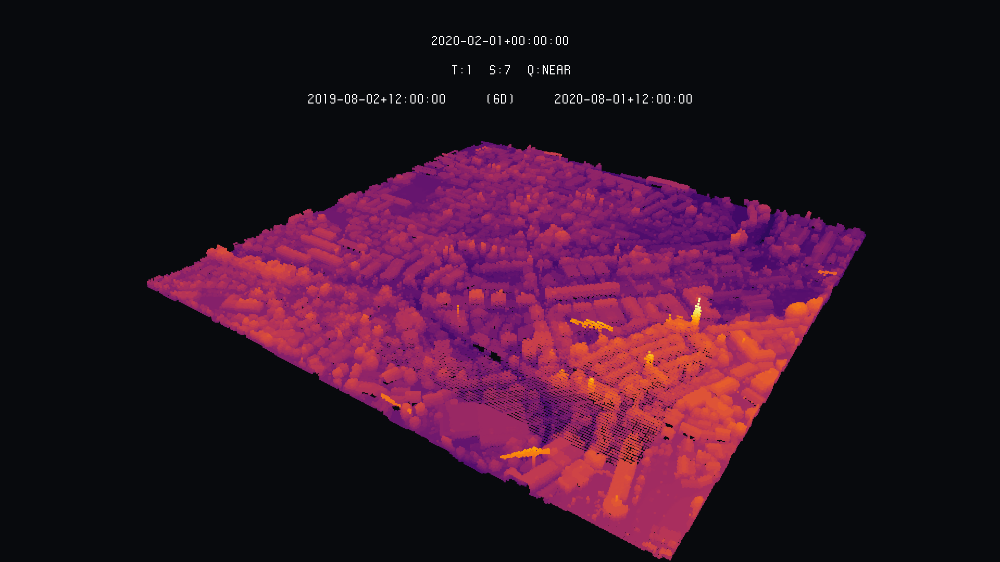

# Overview

This is writing uv3 files out of LiDAR data (.las). The most basic form is writing RGB values based on given **RGB**, if they're already available. Another option is to create RGB values based on file's **height** (Z values). Though this is time-demanding by now and we'll try to optimize this option. For **intensity**, which is also an option, the problem is the same by now. The last option is colouring the UV3 file based on the **classification** given to points. 

## las-to-uv3

### Elevation

For the moment, this is taking only LiDAR data in the Swiss Coordinate System (CH1903+ / LV95), but soon this is also turning into optional. As LiDAR files are usually big, this can be time-demanding, but won't make you run out of memory. For usage, simply open the folder where this code was cloned or downloaded and use the following command. This is writing colours based on elevation.

```
$ python3 las-to-uv3.py -i /home/user/path/to/las/file.las -o /home/user/path/to/output.uv3 
```


### Classification

If you're willing to colour your las file based on classification values, this is the argument you should set as 1 (=*True*), as in the example below. Sometimes classification values do not follow a general rule. If this is the case, you'll need to look in the raw code to change colours and classification values based on your specific case.


```
$ python3 las-to-uv3.py -i /home/user/path/to/las/file.las -o /home/user/path/to/output.uv3 -c 1
```

### Intensity

If what you're really wanting to explore is intensity values, this is the argument you should set as 1:

```
$ python3 las-to-uv3.py -i /home/user/path/to/las/file.las -o /home/user/path/to/output.uv3 -t 1
``` 


### RGB

Finally, if you already have a coloured las file, you might choose this option:

```
$ python3 las-to-uv3.py -i /home/user/path/to/las/file.las -o /home/user/path/to/output.uv3 -r 1
``` 

This option hasn't been tested yet. 

# Copyright and License

las-to-uv3 - Huriel Reichel Nils Hamel Alessandro Cerioni
Copyright (c) 2020 Republic and Canton of Geneva

This program is licensed under the terms of the GNU GPLv3. Documentation and illustrations are licensed under the terms of the CC BY-NC-SA.
